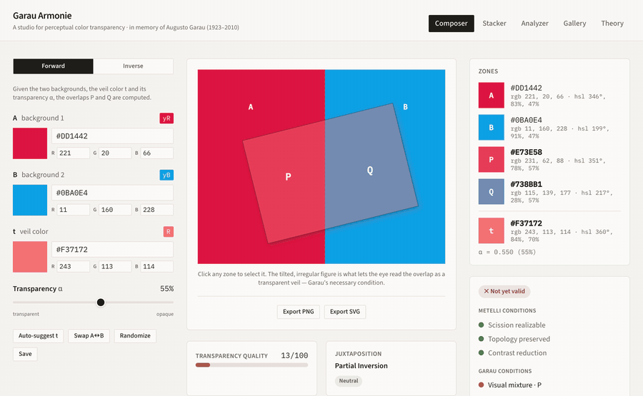
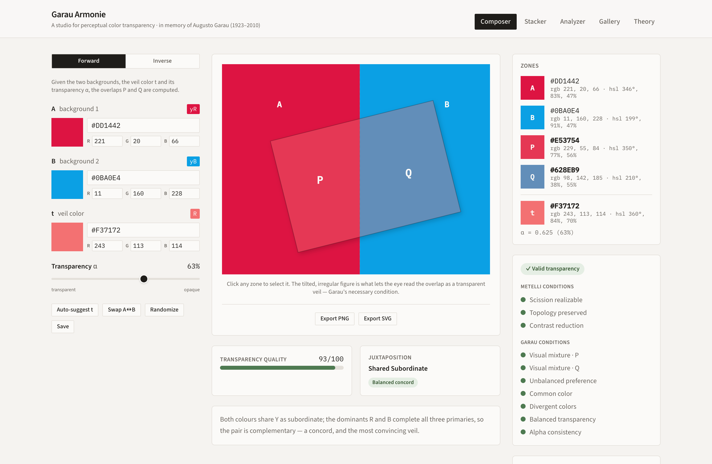
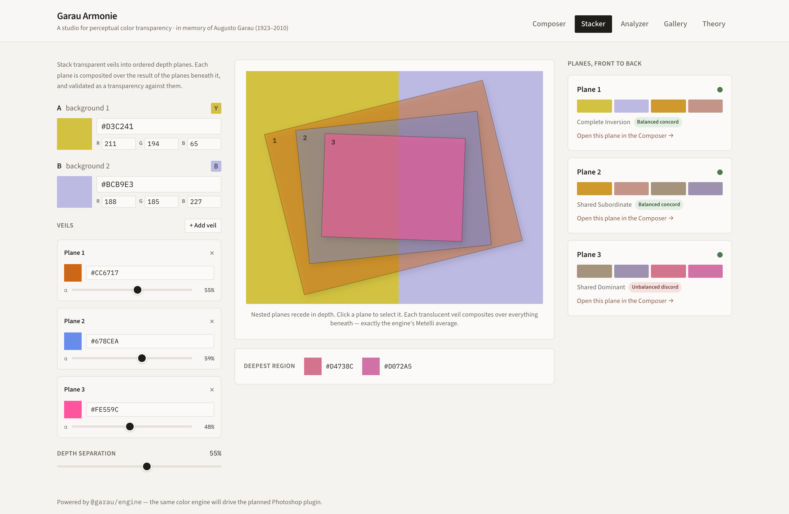
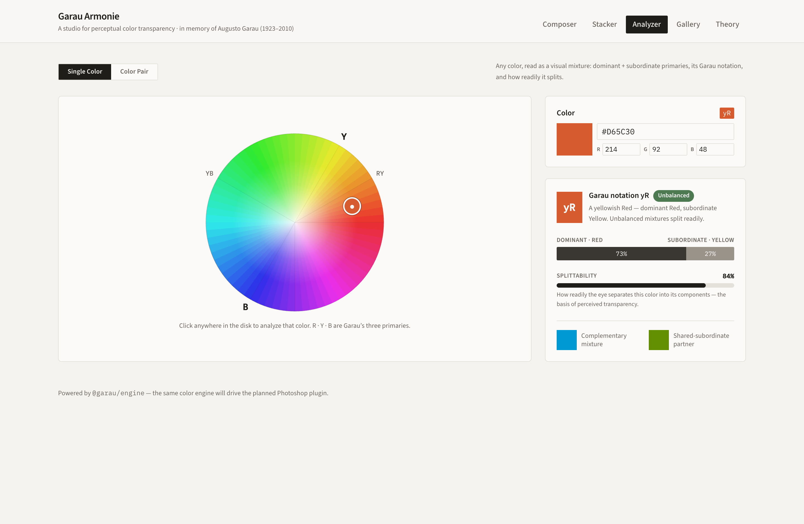
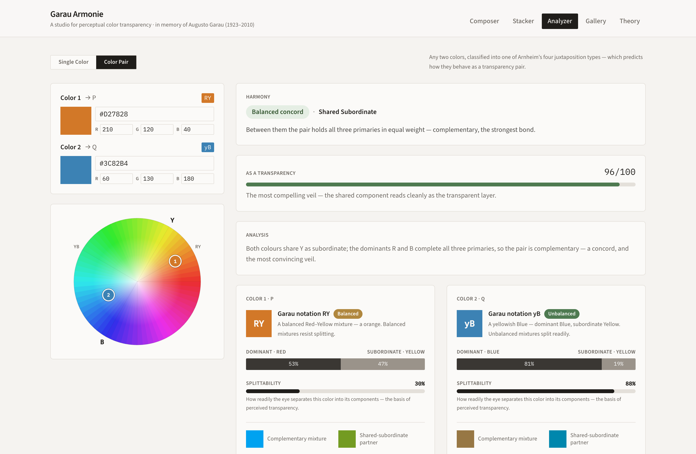
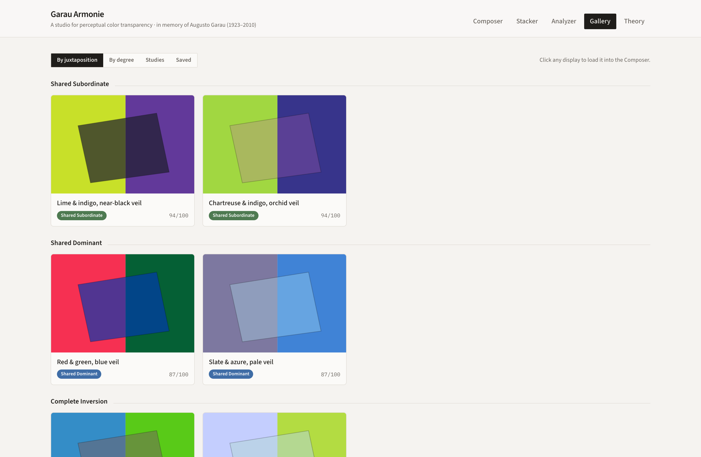
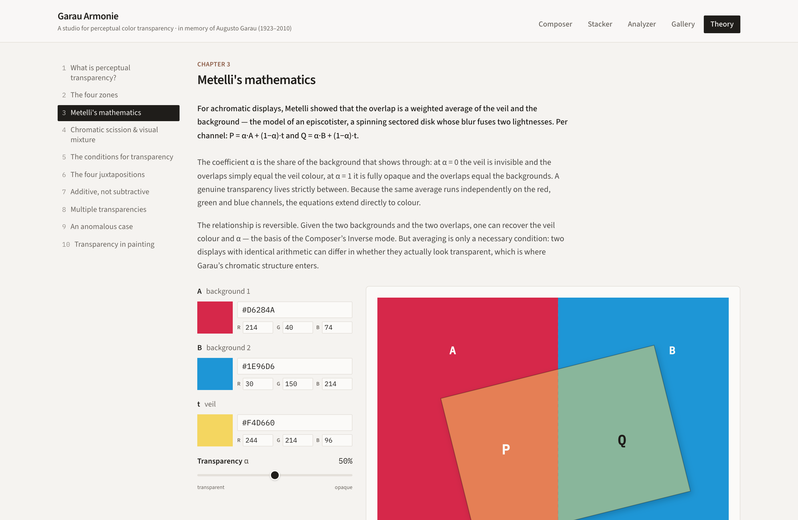
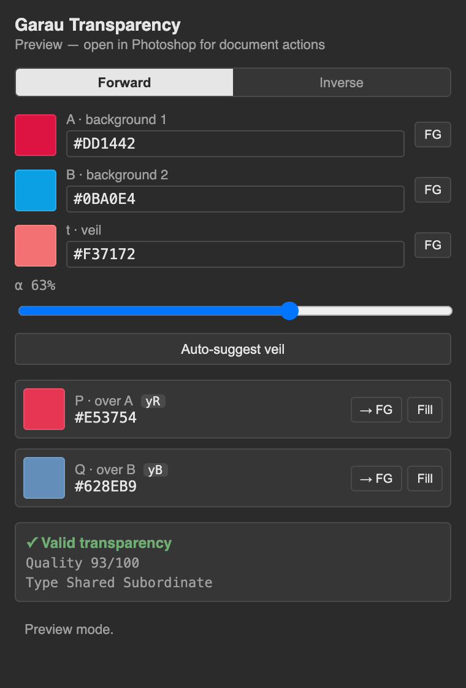

# Garau Armonie

[](https://tsevis.github.io/garauarmonie/)
[](https://github.com/tsevis/garauarmonie/actions/workflows/deploy.yml)

A studio to **teach** Augusto Garau's color theory and **simulate** his theory of
perceptual **Color Transparency**. The name folds *Garau* into *armonie* — the
Italian of his book, *Le armonie del colore*.

> *In memory of Professor Augusto Garau (1923–2010) — painter, scholar and unforgettable professor of color theory and psychology of form.*



Everything runs on **one framework-agnostic TypeScript color engine**
(`@garau/engine`). The web studio and a Photoshop plugin are both thin clients of
the same math, so a color is analyzed identically wherever you meet it.

---

## The studio

### Composer — the four-zone transparency simulator



Set two backgrounds (**A**, **B**), a veil color (**t**) and its transparency
(**α**); the overlaps **P** and **Q** are computed by Metelli's equations. Every
zone is read live for validity (Metelli's three lightness conditions + Garau's
chromatic conditions), a transparency-quality score, and the juxtaposition type
with its concord/discord harmony. **Inverse** mode recovers *t* and *α* from an
existing display, and any figure exports as PNG or SVG. *(The hero above shows the
α slider sweeping live.)*

### Stacker — multiple transparencies



Stack veils into ordered depth planes. Each plane is composited over the
accumulated result beneath it and validated as a transparency against it. Because
a translucent veil drawn at opacity `1−α` composites exactly like Metelli's
average, **what you see equals what the engine computes**. The default walks
Garau's sequence — **Complete Inversion → Shared Subordinate → Shared Dominant** —
with each plane a valid transparency. Open any plane in the Composer.

### Analyzer — visual mixture & harmony



Drop any color on the chromatic disk (Garau's **R · Y · B** primaries) to read its
dominant/subordinate decomposition, Garau notation (e.g. `yR`), and *splittability*
— how readily it separates into a transparent layer. Pair mode classifies two
colors into Arnheim's four juxtapositions and **leads with Garau's concord/discord
harmony grouping**, keeping "how well it reads as a veil" as a separate dimension.



### Gallery — presets & saved displays



Curated, engine-searched transparency displays grouped by juxtaposition type, by
transparency degree, and as original studies. Click any card to load it into the
Composer; save your own to a local collection.

### Theory — an interactive textbook



Ten chapters with live figures: derive Metelli's equations with sliders, watch the
four-zone reading collapse without a second background, see every validity
condition light up or fail, and explore the chromatic disk and the four
juxtapositions. The prose is original exposition grounded in *Color Harmonies*.

### Photoshop plugin



A UXP panel with two tabs, both thin clients of the shared packages.
**Composer** is the same forward/inverse transparency tool as above: pull the
document's foreground color into any slot, compute the overlaps, and push a
result back to the foreground or fill a selection. **Library** browses the
generated Augusto swatch system (`@garau/swatches`) — search, filter by Garau
notation, and read a swatch's full decomposition and live concord neighbours,
the same data `apps/web`'s Gallery and Nino's own Augusto workspace draw on.
Load it via the Adobe UXP Developer Tool (see
[`apps/photoshop/README.md`](apps/photoshop/README.md)).

Illustrator is scoped, not built — UXP has no public API for it as of this
writing, only legacy CEP, a different toolchain Adobe is itself migrating
away from. See [`apps/illustrator/README.md`](apps/illustrator/README.md).

---

## Architecture

The color math lives in **one framework-agnostic TypeScript package**, and the
generated swatch system in a second, so every surface is a thin client of the
same engine and the same data. Adobe UXP plugins are HTML/JS, so the
Photoshop panel imports both packages directly.

```
garauarmonie/
├── packages/
│   ├── engine/         @garau/engine — the color engine (Metelli + Garau).
│   └── swatches/        @garau/swatches — the generated Augusto swatch system.
├── apps/
│   ├── web/             The studio (Vite + React + Tailwind). Ships as a static site.
│   ├── photoshop/        UXP plugin (vanilla TS + esbuild) — Composer + Library tabs.
│   └── illustrator/      Scoped, not built — see its own README for why.
├── docs/screenshots/    The images in this README.
└── reference/           Kept as source material:
    ├── python-engine/     the original Python engine → test oracle
    ├── Transparencies.png     (Garau's required irregular figure)
    └── plan.md
```

*(The book PDF used to ground the Theory text is kept locally but excluded from the
repository — it is copyrighted; the in-app text is original paraphrase.)*

## The engine

`@garau/engine` implements, per RGB channel:

- **Metelli's equations** — `P = α·A + (1−α)·t`, `Q = α·B + (1−α)·t`; forward,
  inverse, designer, and single-veil `compositeVeil` (for stacking).
- **Garau's visual-mixture system** — dominant/subordinate decomposition, notation,
  splittability, Arnheim's four juxtaposition types, and the concord/discord
  harmony grouping.
- **Validation** — Metelli's three conditions + Garau's chromatic conditions.

```bash
npm install
npm run build:engine   # compile the engine to dist/
npm run test:engine    # 32 tests: round-trips, notation, validation, stacking
npm run dev            # run the web studio (http://localhost:5180)
```

## Provenance

Two earlier prototypes of the same idea seeded this project: a React web app
(better UI) and a Python/tkinter app (deeper engine — now the reference oracle).
The engine was ported to TypeScript from the Python implementation, which is kept
in `reference/` as a test oracle. Along the way two bugs in the reference were
fixed: a backwards "lightness ordering" validity condition and a
balanced-transparency check that never used the backgrounds.
